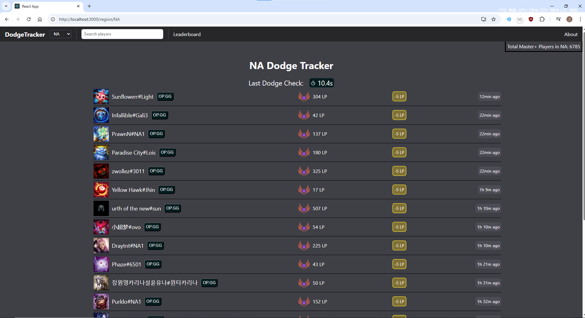
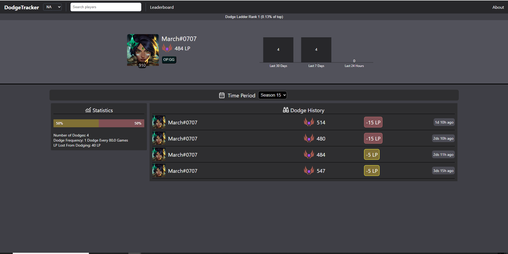
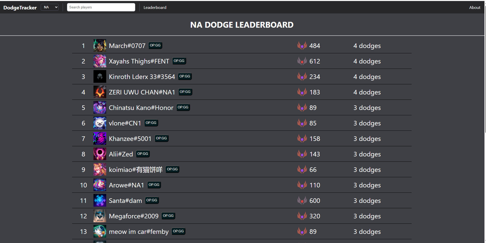

# 🔍 League of Legends Dodge Tracker (Clone)

Track dodges by region for master+ players using Riot's public API with live updates, history, and leaderboards.

## Table of Contents

- [Features](#features)
- [Architecture](#architecture)
- [Tech Stack](#tech-stack)
- [Lessons Learned](#lessons-learned)
- [Pitfalls & Challenges](#pitfalls--challenges)
- [Future Plans](#future-plans)
- [How to Run](#how-to-run)
- [Screenshots](#screenshots)

## Features

- Displays live dodge updates for NA and EUW regions.
- Search summoners and view their dodge history, sortable by season.
- Leaderboard for each region for the most amount of dodges.

## 🏗️ Architecture

## Tech Stack

- Python with flask backend
- React
- MySQL
- Riot Games API

## Lessons Learned

- Implementing batch inserts with error recovery
- Designing scalable LP change tracking logic
- Avoiding duplicate database entries with time-based filters
- Used try/except extensively along with retries and max attempts.
- Handeling Threads to run in parallel.
- Designed scalable code to minimize refactoring.

## Pitfalls & Challenges

- Riot's strict rate limiting made real-time updates hard.
- Riot API 504 errors during peak hours for that region cause slower real time updates.
- The information needed are split into multiple API calls. Therefore, summoner names, levels, and icons will not be updated in the database until they dodged.
- Race conditions when updating overlapping region data.

## Future Improvements

- Periodically update summoner information with a higher rate limit API level.
- Add all the regions (only two regions used because of API rate limit).
- Remove the current 10-second sleep between iterations, which was added to avoid API rate limits. With higher rate limits, this can be eliminated to significantly speed up processing.
- Periodically update summoners to get fresh data not provided in the main looping API call, such as names,levels, and icons.
- Add a season selector to the leaderboard, similar to the dodge history filter.

## How to Run

1. Clone the repo
2. Create a Riot Developer account and request an API Key
3. Initialize the database using `schema.sql`
4. Set up your `.env` file with Riot API key and your database information
5. Run `parse_players.py` this will take a long time if you do not have a high levle riot API key. There are well over 5k players per region and you can only make 100 calls/2 minutes.
6. Run `backend.py` flask backend
7. run `npm start` for react frontend
8. Open `localhost:3000` in your browser

## 📸 Screenshots + Video

  
_Dodge tracking interface_

  
_Player profile view_

  
_Regional rankings_

### 🎥 Live Demo

## License

## Credits

- Riot Games API (data provider)
- https://www.dodgetracker.com/region/na (Orginal website)
